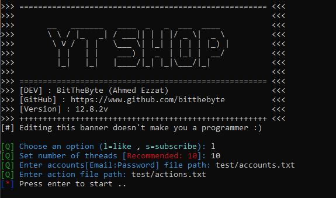

# :notes: YouTubeShop (YTS)
 
Youtube bot for auto-like and auto-subscribe  

```
>>> ===================================================== <<<
>>> 	                                                  <<<
>>> 	  __   _______   ____  _   _  ___  ____           <<<
>>> 	  \ \ / |_   _| / ___|| | | |/ _ \|  _ \          <<<
>>> 	   \ V /  | |   \___ \| |_| | | | | |_) |         <<<
>>> 	    | |   | |    ___) |  _  | |_| |  __/          <<<
>>> 	    |_|   |_|   |____/|_| |_|\___/|_|             <<<
>>> 	                                                  <<<
>>> ===================================================== <<<
>>> [DEV] : BitTheByte (Ahmed Ezzat)                      <<<
>>> [GitHub] : https://www.github.com/bitthebyte          <<<
>>> [Version] : 12.8.2v                                   <<<
>>> +++++++++++++++++++++++++++++++++++++++++++++++++++++ <<<
```
```bash
$ pip install requests
$ pip install colorama
```
```bash
$ python YouTubeShop.py
```



# How to use
- Requirements
  - Fast internet connection
  - 2 Files [Emails Combo, Action File]

### Emails
Your emails combo file should follow this format e.g[ [accounts.txt](https://github.com/BitTheByte/YouTubeShop/blob/master/test/accounts.txt) ]
```
email0@domain.com:0123456789
email1@domain.com:0123456789
email2@domain.com:0123456789
```

  
### Like
You need to create a file which contains videos IDs list e.g[ [actions.txt](https://github.com/BitTheByte/YouTubeShop/blob/master/test/actions.txt) ]. Don't use the full url use the id only
- https://www.youtube.com/watch?v=XnEqfTjp66A [❌]
- XnEqfTjp66A [✔️]
#### Multiple Videos Example
```
ciM6wigZK0w
ineO1tIyPfM
XnEqfTjp66A
```
  
### Subscription
You need to create a file which contains channels IDs list. Don't use the full url use the id only
- https://www.youtube.com/channel/UCs4aHmggTfFrpkPcWSaBN9g [❌]
- UCs4aHmggTfFrpkPcWSaBN9g [✔️]
#### Multiple Channels Example
```
UCs4aHmggTfFrpkPcWSaBN9g
UCzEnk4KWFlSj_PjXLz0-GMA
UCto7D1L-MiRoOziCXK9uT5Q
```

# FAQ
[❓]: Which python version do i need?    
[A]:  Python 2.7.16    
  
[❓]: I'm not getting any results, why?  
[A]:  Check your emails 

[❓]: Program asking me to  `Enter accounts [Email:password] file path`  
[A]:  Use the emails combo file you've created   
    
[❓]: Program asking me to `Enter action file path`  
[A]:  The action file is the file which has the channels/videos IDs in it. Refear to [Subscription](#subscription) or [Like](#like) section to know how to create one

# TO-DO
- Post a comment (Scheduled to the next public release)(Delayed)
- Post a random comment based on channel's comments and users
- Local proxy connection (For debugging)  ✓
- Local web sever to manage the ouput instead of the console
- Advanced debugging mode for advanced users ✓
- Migrate to module instead of single `.py` file ✓

# Donation
**Buy me a digital coffee :)** BTC:36JDUYhEWWiPBXssQYeR2iwoG12KT8dmtJ :point_left:  

Made with ❤️ in Egypt 
