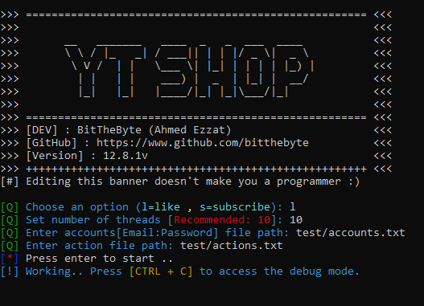

# :notes: YouTubeShop (YTS)
 
Youtube bot for auto-like and auto-subscribe  

```
>>> ===================================================== <<<
>>> 	                                                  <<<
>>> 	  __   _______   ____  _   _  ___  ____           <<<
>>> 	  \ \ / |_   _| / ___|| | | |/ _ \|  _ \          <<<
>>> 	   \ V /  | |   \___ \| |_| | | | | |_) |         <<<
>>> 	    | |   | |    ___) |  _  | |_| |  __/          <<<
>>> 	    |_|   |_|   |____/|_| |_|\___/|_|             <<<
>>> 	                                                  <<<
>>> ===================================================== <<<
>>> [DEV] : BitTheByte (Ahmed Ezzat)                      <<<
>>> [GitHub] : https://www.github.com/bitthebyte          <<<
>>> [Version] : 12.8v                                     <<<
>>> +++++++++++++++++++++++++++++++++++++++++++++++++++++ <<<
```
```bash
$ pip install requests
$ pip install colorama
```
```bash
$ python YouTubeShop.py
```


# Updates
**11/04/2018**: This tools is not working any more please help if you can .. updates are coming soon ⚡️  
**11/04/2018**: Back to work! however the fix is unstable and may result in false positives 😃  
**01/24/2019**: The ultimate update!


# TO-DO
- Post a commnet
- Post a random comment based on channel's comments and users
- Local proxy connection (For debugging)  ✓
- Local web sever to manage the ouput instead of the console
- Advanced debugging mode for advanced users ✓
- Migrate to module instead of single `.py` file ✓

# Donation
**Buy me a digital coffee :)** BTC:36JDUYhEWWiPBXssQYeR2iwoG12KT8dmtJ :point_left:  

Made with ❤️ in Egypt 
